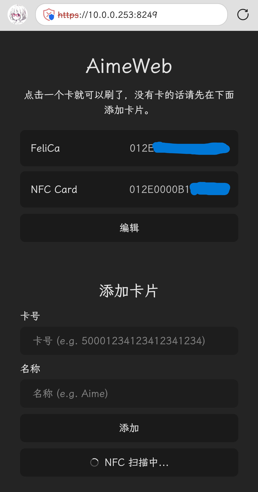

# AimeWeb

Segatools 读卡器前端，用来在没有读卡器的时候可以选择刷不同的卡的工具



# 装

需要安装 python > 10

```
git clone https://github.com/MaigoLabs/AimeWeb
cd AimeWeb
pip install -r requirements.txt
```

# 配

编辑 `src/main.py` 文件

```py
AIME_PATH = "aime.txt"      # segatools aimePath
KEY = 0x0D                  # segatools card scan key
PORT = 8249                 # HTTP Port
```

# 跑

```
python src/main.py
```

# 用

浏览器打开 `https://{LAN ip}:8249`

(注意是 httpS 不是 http!!! 这是因为只有 https 才能使用 WebNFC)
