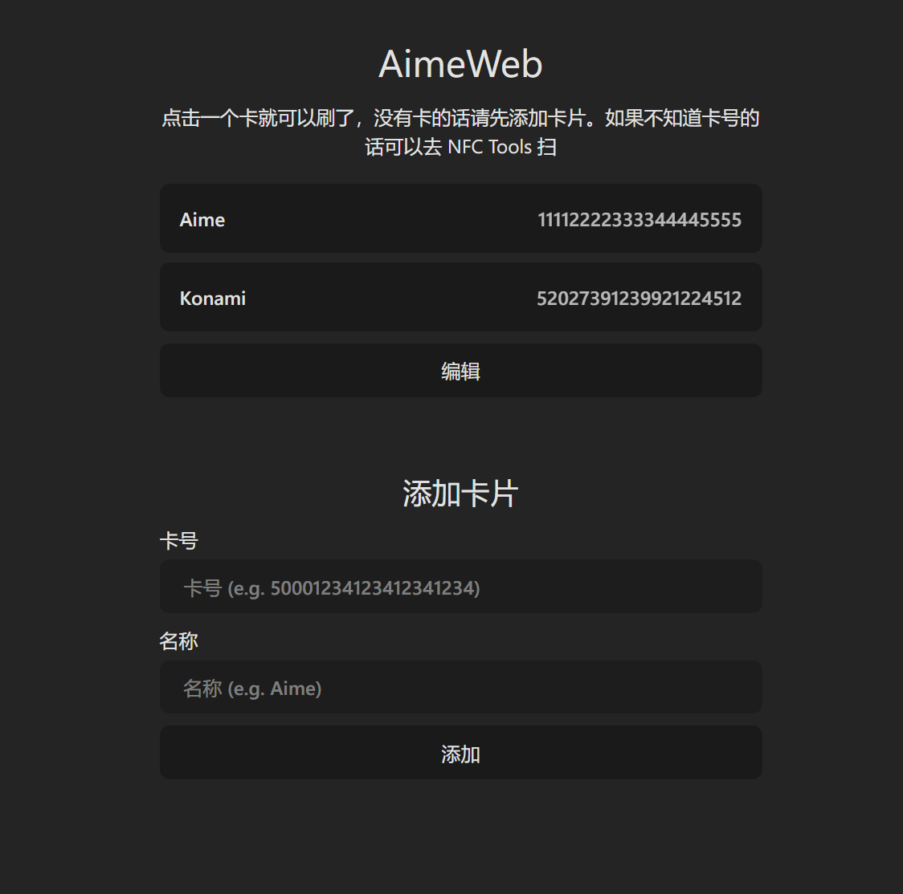

# AimeWeb

Segatools 读卡器前端



# 装

```
git clone https://github.com/MaigoLabs/AimeWeb
cd AimeWeb
python3 -m venv venv
venv/bin/pip install -r requirements.txt
```

# 配

编辑 `src/main.py` 文件

```py
AIME_PATH = "aime.txt"      # segatools aimePath
KEY = 0x0D                  # segatools card scan key
PORT = 8249                 # HTTP Port
```

# 跑

```
venv/bin/python3 src/main.py
```

# 用

浏览器打开 `http://{LAN ip}:8249`
